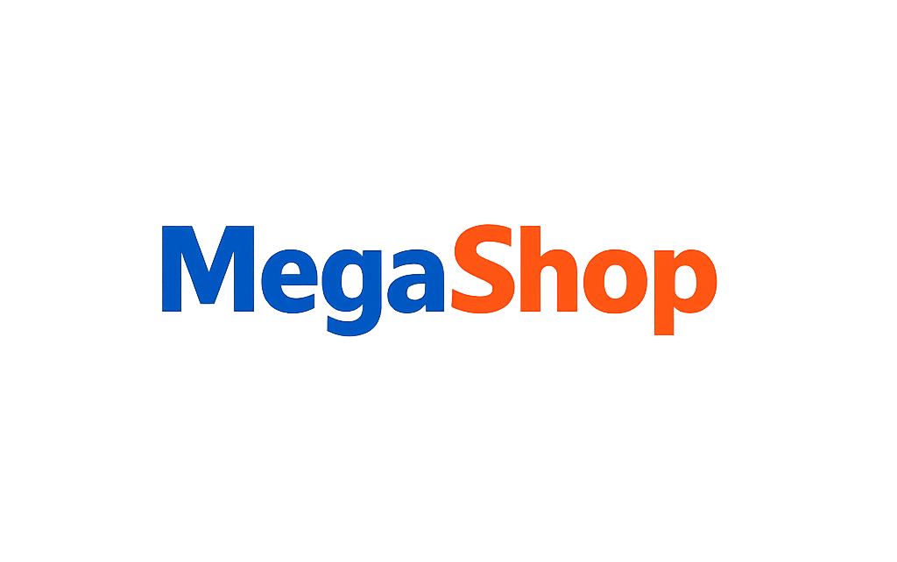

# Mega Shop | Teal Edition 🛍️

Sistema de negocio mínimo, con carrito de compras, administración de stock e ítems y stock a la venta, login y registro simples, sistema de ventas directa sin validación ni cobros. Esquema listo para utilizar en cualquier proyecto.



## 🌟 Características Principales

- **Gestión de Productos:** Creación, edición y control de stock.
- **Productos VIP:** Sistema de destacados con insignias especiales.
- **Carrito de Compras:** Experiencia fluida con persistencia de sesión.
- **Panel Administrativo:** Control total sobre categorías, órdenes y tickets.
- **Sistema de Soporte:** Generación y respuesta de tickets de usuario.
- **Multilingüe:** Soporte nativo para Español e Inglés.
- **Estética Teal:** Diseño moderno, responsivo y con modo oscuro integrado.

## 🚀 Instalación y Despliegue

Sigue estos pasos para poner en marcha tu propia instancia de Mega Shop:

### Requisitos Previos
- PHP 8.2+
- Composer
- Node.js & NPM
- SQLite (o tu base de datos preferida)

### Pasos de Instalación

1. **Clonar el repositorio:**
   ```bash
   git clone https://github.com/yeib/MegaShop.git
   cd MegaShop
   ```

2. **Instalar dependencias de PHP:**
   ```bash
   composer install
   ```

3. **Instalar dependencias de Frontend:**
   ```bash
   npm install
   npm run build
   ```

4. **Configurar el entorno:**
   ```bash
   cp .env.example .env
   php artisan key:generate
   ```

5. **Preparar la base de datos:**
   ```bash
   touch database/database.sqlite
   php artisan migrate --seed
   ```

6. **Iniciar el servidor:**
   ```bash
   php artisan serve
   ```

## 🛠️ Comandos de Mantenimiento

- **Limpiar caché general:** `php artisan optimize:clear`
- **Refrescar base de datos (Tests):** `php artisan migrate:fresh --seed`
- **Correr tests:** `php artisan test`

---
**Mega Shop** - *Built with precision and the Teal Signature.*
